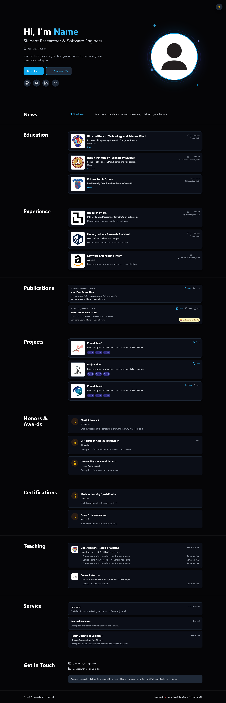

# Portfolio Website Template

A modern, fully customizable portfolio website built with React, TypeScript, and Tailwind CSS. Perfect for developers, researchers, and academics to showcase their work, publications, and achievements.

<p align="center">
  
  
</p>

## ✨ Features

- **🎨 Modern Design**: Clean, professional design with smooth animations and CSS effects
- **🌓 Dark Mode**: Beautiful dark/light theme toggle with persistent preference
- **📱 Fully Responsive**: Optimized for all screen sizes from mobile to desktop
- **⚡ Fast Performance**: Built with Vite for lightning-fast load times
- **♿ Accessible**: WCAG compliant with semantic HTML and ARIA labels
- **🎯 SEO Optimized**: Meta tags and semantic structure for better discoverability
- **📊 Multiple Sections**: Education, Experience, Publications, Projects, Awards, Certifications, Teaching, Service, and News
- **🔗 Smart Links**: Clickable titles and cards with external links
- **💼 Easy Customization**: Simple JSON files for all content - no code changes needed
- **📄 Publication Formatting**: Automatic author name highlighting in publication lists
- **🎓 Academic Focus**: Designed specifically for researchers and academics
- **🖼️ Visual Polish**: Animated profile section with particles and gradients

## 🚀 Quick Start

### Prerequisites

- **Node.js** (v18 or higher)
- **npm** or **yarn**

### Installation

1. **Clone the repository**
   ```bash
   https://github.com/pranav-m-r/Portfolio-Template.git
   cd portfolio-template
   ```

2. **Install dependencies**
   ```bash
   npm install
   ```

3. **Start the development server**
   ```bash
   npm run dev
   ```

4. **Open your browser**
   Navigate to `http://localhost:5173`

### Building for Production

```bash
npm run build
```

The build output will be in the `dist/` folder, ready to deploy.

### Preview Production Build

```bash
npm run preview
```

## 📝 Customization Guide

All content is managed through JSON files in `src/data/`. Simply edit these files to update your portfolio - no coding required!

### Personal Information

**File**: `src/data/personal.json`

```json
{
  "name": "Your Name",
  "title": "Your Title (e.g., Student Researcher & Software Engineer)",
  "email": "your.email@example.com",
  "github": "https://github.com/yourusername",
  "linkedin": "https://linkedin.com/in/yourusername",
  "scholar": "https://scholar.google.com/citations?user=YOUR_ID",
  "website": "https://yourwebsite.com",
  "location": "Your City, Country",
  "bio": "Your bio here. Describe your background, interests, and what you're currently working on.",
  "resumeUrl": "/assets/CV.pdf",
  "profileImage": "/images/profile.jpg"
}
```

**Required Fields**: name, title, email, bio  
**Optional Fields**: All social links, resumeUrl, profileImage

---

### Education

**File**: `src/data/education.json`

```json
[
  {
    "id": "unique-id",
    "institution": "University Name",
    "location": "City, Country",
    "degree": "Degree Name (e.g., Bachelor of Science in Computer Science)",
    "minor": "Minor or Specialization (optional)",
    "metric": "GPA",
    "score": "3.95/4.0",
    "period": "Aug 2020 – May 2024",
    "logo": "/images/university-logo.png",
    "link": "https://university.edu"
  }
]
```

**Required Fields**: id, institution, degree, period  
**Optional Fields**: location, minor, metric, score, logo, link

---

### Experience

**File**: `src/data/experience.json`

```json
[
  {
    "id": "unique-id",
    "organization": "Company/Lab Name",
    "role": "Your Role",
    "period": "Jan 2024 – Present",
    "location": "City, Country",
    "type": "research",
    "highlights": [
      "Key responsibility or achievement 1",
      "Key responsibility or achievement 2",
      "Key responsibility or achievement 3"
    ],
    "image": "/images/org-logo.png",
    "link": "https://organization.com"
  }
]
```

**Required Fields**: id, organization, role, period, type  
**Optional Fields**: location, highlights, image, link

**Type Options**: `"research"` or `"industry"`

---

### Publications

**File**: `src/data/publications.json`

```json
[
  {
    "id": "unique-id",
    "title": "Your Paper Title",
    "authors": "Author 1*, Your Name*, Author 3, Author 4",
    "venue": "Conference/Journal Name or 'Under Review'",
    "year": 2024,
    "status": "Published",
    "links": {
      "paper": "https://link-to-paper.com",
      "code": "https://github.com/username/repo",
      "slides": "https://link-to-slides.com",
      "info": "https://project-page.com"
    },
    "award": "Best Paper Award (optional)"
  }
]
```

**Required Fields**: id, title, authors, venue, year  
**Optional Fields**: status, links (paper, code, slides, info), award

**Notes**:
- Your name (from `personal.json`) will be automatically bolded in the author list
- Use `*` to denote equal contribution
- `status` options: "Published", "Preprint", "Under Review"

---

### Projects

**File**: `src/data/projects.json`

```json
[
  {
    "id": "unique-id",
    "title": "Project Name",
    "description": "Brief description of what this project does and its key features.",
    "tags": ["React", "TypeScript", "Node.js"],
    "image": "/images/project-image.png",
    "github": "https://github.com/username/project",
    "demo": "https://demo-link.com",
    "link": "https://primary-link.com"
  }
]
```

**Required Fields**: id, title, description  
**Optional Fields**: tags, image, github, demo, link

**Notes**:
- `link` is the primary link when clicking the title
- `github` and `demo` buttons appear separately

---

### Awards & Honors

**File**: `src/data/awards.json`

```json
[
  {
    "id": "unique-id",
    "title": "Award Name",
    "organization": "Awarding Organization",
    "year": "2024",
    "description": "Brief description of the award and why you received it.",
    "link": "https://award-page.com"
  }
]
```

**Required Fields**: id, title, organization, year  
**Optional Fields**: description, link

---

### Certificates

**File**: `src/data/certificates.json`

```json
[
  {
    "id": "unique-id",
    "title": "Certificate/Program Name",
    "organization": "Issuing Organization",
    "year": "2024",
    "description": "Brief description of the certification content or program.",
    "link": "https://certificate-link.com"
  }
]
```

**Required Fields**: id, title, organization  
**Optional Fields**: year, description, link

---

### Teaching

**File**: `src/data/teaching.json`

```json
[
  {
    "id": "unique-id",
    "role": "Teaching Assistant / Instructor",
    "organization": "Department, University",
    "period": "2023 – 2024",
    "location": "City, Country",
    "image": "/images/department-logo.png",
    "link": "https://department.edu",
    "courses": [
      {
        "name": "Course Name (Course Code)",
        "instructor": "Prof. Name (optional)",
        "semester": "Fall 2024"
      }
    ]
  }
]
```

**Required Fields**: id, role, organization, courses  
**Optional Fields**: period, location, image, link

**Notes**:
- Each course can optionally include `instructor`
- Semester appears on the right side of the card

---

### Service

**File**: `src/data/service.json`

```json
[
  {
    "role": "Position Title",
    "organization": "Organization Name (optional)",
    "period": "2023 – 2024",
    "description": "Brief description of responsibilities and activities.",
    "link": "https://organization.com"
  }
]
```

**Required Fields**: role, description  
**Optional Fields**: organization, period, link

---

### News & Updates

**File**: `src/data/news.json`

```json
[
  {
    "id": "unique-id",
    "date": "January 2024",
    "summary": "Brief news or update about an achievement, publication, or milestone.",
    "link": "https://optional-link.com"
  }
]
```

**Required Fields**: id, date, summary  
**Optional Fields**: link

---

## 🖼️ Adding Images & Assets

### Profile Image
- **Path**: `public/images/profile.jpg`
- **Recommended Size**: 400x400px square
- **Format**: JPG, PNG, or WebP

### Organization/Institution Logos
- **Path**: `public/images/`
- **Recommended Size**: 200x200px or larger
- **Format**: PNG with transparent background preferred

### Project Images
- **Path**: `public/images/`
- **Recommended Size**: 200x200px or larger
- **Format**: PNG with transparent background preferred

### Resume/CV
- **Path**: `public/assets/CV.pdf`
- **Format**: PDF
- **Note**: Update the `resumeUrl` field in `personal.json`

### Adding New Images

1. Place your image in `public/images/` or `public/assets/`
2. Reference it in JSON files using `/images/filename.png` or `/assets/filename.pdf`
3. Images in the `public/` folder are accessible at build time

---

## 🎨 Customizing Colors & Styling

### Primary Color
Edit `tailwind.config.js`:

```js
theme: {
  extend: {
    colors: {
      'primary-blue': '#3b82f6', // Change this to your preferred color
    }
  }
}
```

### Dark Mode Colors
The website uses Tailwind's dark mode. Colors automatically adjust based on the theme.

### Font
Default font is Inter. To change, edit `index.html`:

```html
<link href="https://fonts.googleapis.com/css2?family=Your+Font&display=swap" rel="stylesheet">
```

And update `tailwind.config.js`:

```js
fontFamily: {
  sans: ['Your Font', 'sans-serif'],
}
```

---

## 🚢 Deployment

### GitHub Pages

1. Update `vite.config.ts`:
   ```ts
   base: '/your-repo-name/'
   ```

2. Build the project:
   ```bash
   npm run build
   ```

3. Deploy the `dist/` folder to GitHub Pages

### Vercel / Netlify

1. Connect your repository
2. Build command: `npm run build`
3. Output directory: `dist`
4. Deploy automatically on push

### Custom Domain

Update the `website` field in `src/data/personal.json` and configure your DNS settings.

---

## 🛠️ Tech Stack

- **Framework**: React 18.3
- **Language**: TypeScript 5.5
- **Build Tool**: Vite 5.4
- **Styling**: Tailwind CSS 3.4
- **Icons**: React Icons (Feather Icons, Hero Icons)
- **Animations**: Pure CSS animations (no external libraries)

---

## 📂 Project Structure

```
portfolio-template/
├── public/
│   ├── images/          # Organization logos, profile picture
│   ├── assets/          # CV, documents
│   └── favicon.ico
├── src/
│   ├── components/      # Reusable UI components
│   │   ├── AwardCard.tsx
│   │   ├── CertificateCard.tsx
│   │   ├── EducationCard.tsx
│   │   ├── ExperienceCard.tsx
│   │   ├── NewsCard.tsx
│   │   ├── ProjectCard.tsx
│   │   ├── PublicationCard.tsx
│   │   ├── ServiceCard.tsx
│   │   ├── TeachingCard.tsx
│   │   └── ThemeToggle.tsx
│   ├── data/            # JSON data files (EDIT THESE!)
│   │   ├── personal.json
│   │   ├── education.json
│   │   ├── experience.json
│   │   ├── publications.json
│   │   ├── projects.json
│   │   ├── awards.json
│   │   ├── certificates.json
│   │   ├── teaching.json
│   │   ├── service.json
│   │   └── news.json
│   ├── sections/        # Page sections
│   │   ├── Hero.tsx
│   │   ├── News.tsx
│   │   ├── Education.tsx
│   │   ├── Experience.tsx
│   │   ├── Publications.tsx
│   │   ├── Projects.tsx
│   │   ├── Awards.tsx
│   │   ├── Certificates.tsx
│   │   ├── Teaching.tsx
│   │   ├── Service.tsx
│   │   └── Contact.tsx
│   ├── types/           # TypeScript interfaces
│   │   └── index.ts
│   ├── App.tsx          # Main app component
│   ├── index.css        # Global styles & animations
│   └── main.tsx         # Entry point
├── package.json
├── tailwind.config.js
├── tsconfig.json
├── vite.config.ts
└── README.md
```

---

## 🎯 Usage Tips

### 1. Start with Personal Information
Fill out `src/data/personal.json` first - this is used throughout the site.

### 2. Add Your Content Gradually
You don't need to fill all sections at once. Comment out sections in `App.tsx` if you want to hide them temporarily.

### 3. Optimize Images
Compress images before adding them to reduce load times. Use tools like TinyPNG or ImageOptim.

### 4. Test Responsiveness
Always check your portfolio on different screen sizes (mobile, tablet, desktop).

### 5. Keep It Updated
Regularly update your publications, projects, and news to keep your portfolio fresh.

### 6. Use Consistent Formatting
Follow the same format for dates and titles across all sections for a professional look.

---

## ❓ Common Questions

**Q: How do I hide a section I don't need?**  
A: Comment out or remove the section import and component from `src/App.tsx`.

**Q: Can I change the order of sections?**  
A: Yes! Reorder the section components in `src/App.tsx`.

**Q: My images aren't showing up**  
A: Make sure images are in the `public/` folder and paths start with `/` (e.g., `/images/logo.png`).

**Q: How do I change the theme colors?**  
A: Edit the `primary-blue` color in `tailwind.config.js`.

**Q: Can I add a blog section?**  
A: Yes! Create a new JSON file, TypeScript interface, component, and section following the existing patterns.

---

## 📄 License

MIT License - feel free to use this template for your personal portfolio!

---

## 🙏 Credits

- Icons by [React Icons](https://react-icons.github.io/react-icons/)
- Fonts by [Google Fonts](https://fonts.google.com/)
- Built with [Vite](https://vitejs.dev/) and [React](https://react.dev/)

---

## 🤝 Contributing

Found a bug or have a feature request? Please open an issue on GitHub!

---

## 📧 Support

If you have questions or need help customizing your portfolio, feel free to reach out or open an issue.

---

**Made with ❤️ for developers and researchers**

